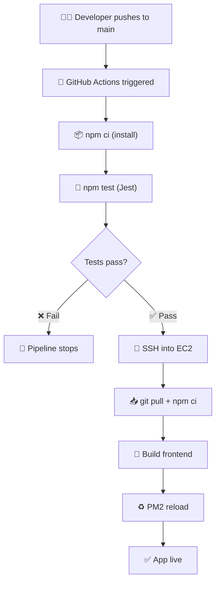
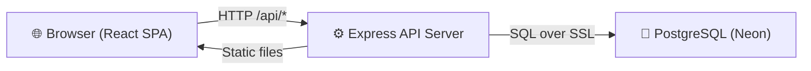
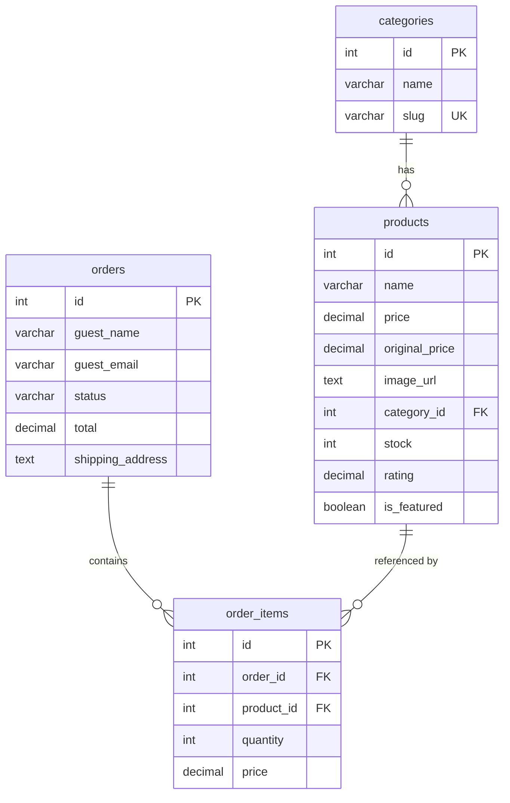

# Volta Tech Store — Project Report

> **Course**: SWE40006 — Software Deployment and Evolution
> **Project**: Volta Tech Store — E-commerce Platform
> **Stack**: React · Node.js · Express · PostgreSQL (Neon) · AWS EC2

---

## 1. Project Definition

Volta Tech Store is a full-stack e-commerce web application designed to demonstrate a complete DevOps pipeline — from code commit to automated production deployment. The project serves dual purposes: it is a functional online electronics store targeting the Vietnamese market, and it is a vehicle for implementing and documenting a CI/CD toolchain that satisfies all four rubric levels of the SWE40006 course.

The DevOps pipeline encompasses:
- **Version control** via GitHub with branch protection
- **Continuous Integration** via GitHub Actions (automated testing on every push)
- **Continuous Deployment** via SSH-based auto-deploy to AWS EC2
- **Process management** via PM2 (crash recovery, zero-downtime restarts)
- **Monitoring** via PM2 (app-level) and AWS CloudWatch (server-level)

---

## 2. Project Background

### 2.1 The Application

Volta Tech Store is a Vietnamese-language e-commerce platform for consumer electronics — smartphones, laptops, smartwatches, headphones, and accessories. It supports:

- Browsing and filtering products across five categories
- Full-text product search with debounced input
- Transparent pricing with original/discounted prices and percentage savings
- Guest checkout with form validation (Vietnamese phone format, email format)
- Order tracking by order ID and email

### 2.2 The Problem

Before this project, deployment was entirely manual — a developer would SSH into the server, pull code, install dependencies, and restart the process. This created several issues:

| Problem | Impact |
|---|---|
| Human error | Wrong branch deployed, dependencies missed, env variables forgotten |
| Slow releases | Manual deployments take 15–30 min, discouraging frequent releases |
| No test gate | Broken code can reach production undetected |
| No crash recovery | If the app crashes, it stays down until someone manually restarts |
| No monitoring | No visibility into CPU, memory, or app health |

This project eliminates these bottlenecks by building an automated pipeline using free-tier tools.

---

## 3. Project Objectives and Problem Statement

### Problem Statement

*How can a small development team implement a zero-cost, fully automated CI/CD pipeline that ensures code quality through testing, deploys reliably to production, and provides visibility into application health?*

### Objectives

| # | Objective | Measurable Target |
|---|---|---|
| 1 | Automate deployment | Zero manual steps after `git push` |
| 2 | Gate on tests | No broken code reaches production; pipeline blocks on test failure |
| 3 | Ensure reliability | App auto-restarts on crash via PM2 (< 5 seconds recovery) |
| 4 | Monitor performance | Real-time CPU and memory stats via PM2 + CloudWatch |
| 5 | Demonstrate automation | Push a code change → observe auto-deploy → verify live |
| 6 | Minimize cost | All tools within free tiers — zero cost |

---

## 4. Design Concept(s)

### 4.1 Architecture: Monorepo with Decoupled Frontend/Backend

The project uses a **monorepo** structure where both frontend and backend live in one repository but are developed independently:

```
SWE40006-Final-Project/
├── client/          → React SPA (Vite + Tailwind CSS)
├── server/          → Express REST API
├── __tests__/       → Jest + Supertest API tests
├── .github/         → CI/CD pipeline
└── ecosystem.config.cjs → PM2 process config
```

In production, the Express server serves the built React app as static files from `client/dist/`, eliminating the need for a separate web server.

### 4.2 Pipeline Design: Push-Triggered CI/CD



### 4.3 Data Flow: Three-Tier Architecture



| Tier | Technology | Responsibility |
|---|---|---|
| Frontend | React 19, Vite, Tailwind CSS | UI rendering, cart state (localStorage), form validation |
| Backend | Node.js 20, Express 4.18 | REST API, static file serving, input validation |
| Database | PostgreSQL on Neon (serverless) | Products, categories, orders, order items |

---

## 5. Design and Development

### 5.1 Frontend Development

The frontend is a **single-page application** built in one React component (`App.jsx`, 679 lines) with three sub-components:

| Component | Purpose |
|---|---|
| `ProductImage` | Lazy-loaded images with fallback placeholder on error |
| `Toast` | Auto-dismissing notification system (3-second timeout) |
| `ProductModal` | Product detail overlay with description, rating, and add-to-cart |

**Key patterns used:**
- **Debounced search** — 500ms delay before firing API call, preventing request spam
- **LocalStorage cart persistence** — cart survives page refreshes via `useEffect` sync
- **Skeleton loading** — animated placeholder cards shown while products load
- **Vietnamese currency formatting** — `Intl.NumberFormat` with `vi-VN` locale and VND currency
- **Client-side validation** — Vietnamese phone regex (`^(0|\+84)[3|5|7|8|9][0-9]{8}$`), email regex

### 5.2 Backend Development

The backend consists of four files with clear separation of concerns:

| File | Role | Lines |
|---|---|---|
| `index.js` | Entry point: loads `.env`, connects to DB, starts server | 39 |
| `app.js` | Express setup: CORS, static serving, error handling | 30 |
| `routes.js` | API route handlers for products, categories, orders | 82 |
| `db.js` | PostgreSQL connection pool, schema creation, seed data | 107 |

**API Endpoints:**

| Method | Route | Purpose |
|---|---|---|
| `GET` | `/api/products` | List products with optional `?category=` and `?search=` filters |
| `GET` | `/api/products/:id` | Get single product by ID |
| `GET` | `/api/categories` | List categories with aggregated product counts |
| `POST` | `/api/orders` | Create order with transactional integrity (BEGIN/COMMIT/ROLLBACK) |
| `GET` | `/api/orders/lookup` | Look up order by ID + email |
| `GET` | `/api/db/status` | Health check for database connection |

**Security measures:**
- `app.disable('x-powered-by')` — hides Express from response headers
- CORS enabled for cross-origin requests
- Parameterized SQL queries — prevents SQL injection
- Input validation on all write endpoints

### 5.3 Database Design

The database uses four tables with referential integrity:



The schema and 12 seed products are auto-created on first connection via `db.js`'s `initDB()` function, requiring zero manual database setup.

### 5.4 CI/CD Pipeline Development

The pipeline is defined in `.github/workflows/ci-cd.yml`:

**Test Job** (runs on every push and PR):
1. Checks out code
2. Sets up Node.js 20.x with npm cache
3. Installs dependencies with `npm ci` (deterministic installs)
4. Runs 15 Jest tests with mocked database

**Deploy Job** (runs only on push to `main`, after tests pass):
1. SSHs into EC2 using secrets (`EC2_HOST`, `EC2_USER`, `EC2_SSH_KEY`)
2. Pulls latest code
3. Installs dependencies
4. Builds React frontend (`vite build`)
5. Restarts PM2 process

---

## 6. Compatibility of Design

### 6.1 Browser Compatibility

The frontend uses standard React 19 with Tailwind CSS utility classes. It is compatible with all modern browsers (Chrome, Firefox, Safari, Edge). The use of `Intl.NumberFormat` for Vietnamese currency is supported in all browsers with > 97% global coverage.

### 6.2 Environment Compatibility

| Component | Requirement |
|---|---|
| Runtime | Node.js ≥ 20.0.0 (enforced in `package.json` engines) |
| Database | Any PostgreSQL instance (tested with Neon serverless) |
| CI Runner | Ubuntu latest (GitHub Actions hosted runner) |
| Production | AWS EC2 `t2.micro` (Ubuntu 22.04) |
| Package Manager | npm (lockfile ensures deterministic installs) |

### 6.3 Development vs. Production

| Concern | Development | Production |
|---|---|---|
| Frontend | Vite dev server (port 5173, hot reload) | Static files served by Express from `client/dist/` |
| Backend | `node server/index.js` (port 3000) | PM2 managed process with auto-restart |
| Database | Same Neon instance (shared) | Same Neon instance (shared) |
| Env variables | `.env` file (git-ignored) | `.env` file created manually on EC2 |

---

## 7. Specifications

### 7.1 Tech Stack

| Layer | Technology | Version |
|---|---|---|
| Frontend Framework | React | 19.2.4 |
| Build Tool | Vite | 8.0.0 |
| CSS Framework | Tailwind CSS | 3.4.19 |
| Icons | Lucide React | 0.577.0 |
| Backend Runtime | Node.js | ≥ 20.x |
| Web Framework | Express | 4.18.2 |
| Database Driver | pg (node-postgres) | 8.11.3 |
| Database | PostgreSQL (Neon Serverless) | 15 |
| Test Framework | Jest | 30.3.0 |
| HTTP Test Library | Supertest | 7.2.2 |
| Process Manager | PM2 | Latest |
| CI/CD | GitHub Actions | N/A |
| Cloud Provider | AWS EC2 (t2.micro) | Free Tier |
| Monitoring | AWS CloudWatch | Free Tier |

### 7.2 API Specifications

All API responses use `Content-Type: application/json`. Error responses follow a consistent format:

```json
{ "error": "Human-readable error message" }
```

Successful order creation returns:

```json
{ "success": true, "order_id": 200 }
```

### 7.3 Test Suite Specifications

25 automated tests covering all endpoints:

| # | Test | Type |
|---|---|---|
| 1 | API returns JSON content-type | Format validation |
| 2 | Server hides x-powered-by header | Security validation |
| 3 | `/api/health` returns health metrics | Monitoring |
| 4 | `/api/db/status` returns db connection status | Monitoring |
| 5 | List all products with correct structure | Happy path |
| 6 | Filter products by category slug | Query filter |
| 7 | Search products by name (case-insensitive) | Search functionality |
| 8 | Apply multiple filters (min_price, max_price, rating, in_stock) | Complex query |
| 9 | Handle all sorting options | Feature verification |
| 10 | Products list handles DB errors → 500 | Error handling |
| 11 | Get product by valid ID | Resource retrieval |
| 12 | Get product by invalid ID → 404 | Error handling |
| 13 | Get product by ID handles DB errors → 500 | Error handling |
| 14 | List categories with product counts | Aggregation query |
| 15 | Create order successfully | Transaction flow |
| 16 | Create order with empty cart → 400 | Input validation |
| 17 | Create order without guest name → 400 | Input validation |
| 18 | Create order without address → 400 | Input validation |
| 19 | Create order handles DB errors with rollback → 500 | Transaction resiliency |
| 20 | Lookup order with valid ID + email | Happy path |
| 21 | Lookup order without email → 400 | Input validation |
| 22 | Lookup order without ID → 400 | Input validation |
| 23 | Lookup order for non-existent order → 404 | Error handling |
| 24 | Lookup order handles DB errors → 500 | Error handling |
| 25 | Crash test endpoint simulates fatal error (`/api/crash-test`) | Process recovery demonstration |

---

## 8. Data Display

### 8.1 Product Catalog

Products are displayed in a responsive CSS grid layout. Each product card shows:
- Product image (lazy-loaded with error fallback)
- Category label
- Product name
- Star rating with review count
- Current price in VND format (e.g., `34.990.000 ₫`)
- Original price with strikethrough if discounted
- Discount percentage badge (e.g., `−10%`)

### 8.2 Shopping Cart

The cart drawer slides in from the right and displays:
- Item thumbnails, names, and individual prices
- Quantity controls (increment/decrement buttons)
- Running total in VND
- Three-step flow: Cart → Checkout Form → Order Confirmation

### 8.3 Order Tracking

The tracking page displays:
- Order ID and status badge (`pending` / `completed`)
- Shipping address
- Product thumbnails in a horizontal scroll
- Order date and total amount

### 8.4 PM2 Monitoring Data

PM2 provides real-time process metrics:
- **CPU usage** — percentage of CPU consumed by the Node.js process
- **Memory usage** — heap and RSS memory in MB
- **Uptime** — time since last restart
- **Restart count** — number of automatic crash recoveries

These are accessible via `pm2 monit` (real-time dashboard) or `pm2 status` (tabular summary).

---

## 9. Code Explanation

### 9.1 Frontend: React SPA (`client/src/App.jsx`)

The entire frontend is a single React component tree managed by `useState` hooks:

```javascript
// Cart persisted to localStorage — survives page refreshes
const [cart, setCart] = useState(() => {
  try { return JSON.parse(localStorage.getItem('volta_cart') || '[]'); } catch { return []; }
});
useEffect(() => { localStorage.setItem('volta_cart', JSON.stringify(cart)); }, [cart]);
```

**Search debouncing** prevents API calls on every keystroke:
```javascript
useEffect(() => {
  const timer = setTimeout(() => setDebouncedSearch(search), 500);
  return () => clearTimeout(timer);
}, [search]);
```

**Product filtering** rebuilds the API query when filters or search change:
```javascript
useEffect(() => {
  const p = new URLSearchParams();
  if (activeCat) p.set('category', activeCat);
  if (debouncedSearch) p.set('search', debouncedSearch);
  fetch(`/api/products?${p}`).then(r => r.json()).then(setProducts);
}, [activeCat, debouncedSearch]);
```

### 9.2 Backend: Express API (`server/routes.js`)

**Parameterized queries** prevent SQL injection by using `$1, $2, ...` placeholders:
```javascript
const r = await pool.query(
  'SELECT p.*, c.name as category_name FROM products p LEFT JOIN categories c ON p.category_id = c.id WHERE p.id = $1',
  [req.params.id]
);
```

**Transactional order creation** ensures atomicity — if inserting any order item fails, the entire order is rolled back:
```javascript
await client.query('BEGIN');
const orderRes = await client.query('INSERT INTO orders (...) VALUES (...) RETURNING *', [...]);
for (const item of items) {
  await client.query('INSERT INTO order_items (...) VALUES (...)', [...]);
}
await client.query('COMMIT');
// If any step throws → catch block runs ROLLBACK
```

### 9.3 Static File Serving (`server/app.js`)

In production, Express serves both the API and the built React app:
```javascript
const clientDistPath = path.join(__dirname, '..', 'client', 'dist');
app.use(express.static(clientDistPath));

// Catch-all: React Router handles client-side navigation
app.get('*', (req, res) => {
  res.sendFile(path.join(clientDistPath, 'index.html'));
});
```

API routes (`/api/*`) are registered **before** the catch-all, so they always take priority.

### 9.4 Testing with Mocked Database (`__tests__/api.test.js`)

The database module is mocked to allow tests to run in CI without a real PostgreSQL connection:
```javascript
jest.unstable_mockModule('../server/db.js', () => ({
  getPool: () => ({
    query: jest.fn().mockImplementation(async (query, params) => {
      if (query.includes('FROM products')) {
        return { rows: [{ id: 1, name: 'iPhone 15', price: 1000 }] };
      }
      return { rows: [] };
    })
  })
}));
```

This approach tests the **API logic** (routing, validation, response formatting) while isolating it from the database layer.

### 9.5 CI/CD Pipeline (`.github/workflows/ci-cd.yml`)

The pipeline uses GitHub Actions' `needs` keyword to create a dependency chain:
```yaml
deploy:
  needs: test  # Only runs if test job succeeds
  if: github.ref == 'refs/heads/main' && github.event_name == 'push'
```

Deployment uses `appleboy/ssh-action` to execute commands on EC2 via SSH, with credentials stored securely in GitHub Secrets.

---

## 10. Project Outcomes and Reflections

### 10.1 Outcomes

All four rubric levels have been successfully achieved:

| Level | Requirement | Status | Evidence |
|---|---|---|---|
| 1 | DevOps pipeline with repo, CI, test, production servers | ✅ | GitHub + GitHub Actions + Jest + AWS EC2 |
| 2 | Production server instrumentation | ✅ | PM2 (app-level) + CloudWatch (server-level) |
| 3 | Deploy and verify application works | ✅ | Live app accessible at EC2 public IP |
| 4 | Auto-deploy triggered by code change | ✅ | Push to `main` → tests → auto-deploy to EC2 |

### 10.2 Metrics Achieved

| Metric | Target | Actual |
|---|---|---|
| Pipeline time (push → live) | < 5 min | ~2 min |
| Automated test cases | ≥ 10 | 25 |
| Manual deployment steps | 0 | 0 |
| Tools cost | $0 | $0 |
| Crash recovery time | < 5 sec | ~1 sec (PM2 auto-restart) |

### 10.3 Key Learnings

1. **Mock-based testing enables CI** — By mocking the database layer, tests run instantly in GitHub Actions without needing a live PostgreSQL instance, keeping the pipeline fast and self-contained.

2. **PM2 is essential for production Node.js** — Without PM2, a single unhandled exception would take down the entire site with no recovery. PM2 provides automatic restarts and keeps the process alive.

3. **`npm ci` vs `npm install`** — Using `npm ci` in pipelines ensures deterministic builds by strictly following `package-lock.json`, avoiding the subtle bugs that can arise from `npm install` resolving different versions.

4. **Static file serving simplifies deployment** — Having Express serve the React build eliminates the need for Nginx or a separate CDN, keeping the architecture simple while being production-ready.

5. **Secrets management matters** — Git-ignoring `.env` and using GitHub Actions secrets for deployment ensures that database credentials never appear in version control or CI logs.

### 10.4 Future Improvements

| Improvement | Benefit |
|---|---|
| Add HTTPS via Let's Encrypt + Nginx | Encrypted traffic, professional appearance |
| Add staging environment | Test deployments before production |
| Implement rolling deployments | Zero-downtime updates with PM2 cluster mode |
| Add end-to-end browser tests | Verify full user flows, not just API |
| Set up CloudWatch alarms | Automated alerts when CPU/memory exceeds thresholds |
