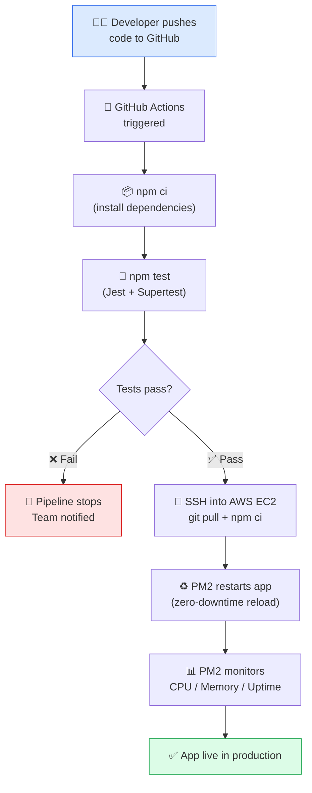
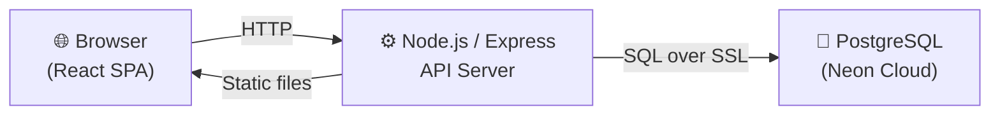

# Volta Tech Store — Project Brief

> **Course**: SWE40006 — Software Deployment and Evolution  
> **Project**: Volta Tech Store — E-commerce Platform  
> **Stack**: Node.js · Express · PostgreSQL · React  

---

## 1. Background of the Project

### 1.1 What the Application Does

Volta Tech Store is a Vietnamese e-commerce web application for consumer electronics — smartphones, laptops, smartwatches, headphones, and accessories. It allows customers to:

- Browse and search products across multiple categories
- View transparent pricing with discount percentages
- Add items to a cart and checkout as a guest
- Track their order by order ID and email

The platform targets price-conscious shoppers in the Vietnamese market who want a fast, simple, and trustworthy purchasing experience.

### 1.2 Why a DevOps Pipeline Is Needed

Currently the app is deployed manually — a developer SSHs into a server, pulls code, installs dependencies, and restarts the process. This creates problems:

| Problem | Impact |
|---|---|
| **Human error** | Wrong branch deployed, dependencies missed, env variables forgotten |
| **Slow releases** | Manual deployments take 15–30 min, discouraging frequent releases |
| **Inconsistent environments** | Works on one machine, fails on another due to version mismatches |
| **No test gate** | Broken code can reach production undetected |
| **No crash recovery** | If the app crashes, it stays down until someone manually restarts it |
| **No monitoring** | No visibility into CPU, memory, or app health |

This project builds an automated pipeline to eliminate these bottlenecks using free tools.

---

## 2. Pipeline Plan

### 2.1 Pipeline Flow

### 2.2 Step-by-Step Walkthrough

| Step | What Happens |
|---|---|
| 1. **Push** | Developer merges code into `main` on GitHub |
| 2. **Trigger** | GitHub Actions automatically starts the CI/CD workflow |
| 3. **Install** | Runner installs dependencies with `npm ci` |
| 4. **Test** | Jest runs all automated tests. Pipeline stops if any test fails |
| 5. **Deploy** | If tests pass, GitHub Actions SSHs into the EC2 server, runs `git pull` and `npm ci` |
| 6. **Restart** | PM2 reloads the app with zero downtime (`pm2 reload volta-store`) |
| 7. **Monitor** | PM2 tracks CPU usage, memory consumption, uptime, and restart count |

---

## 3. Application Overview

### 3.1 Architecture

| Tier | Technology | Role |
|---|---|---|
| **Frontend** | React 18 (via CDN) + vanilla CSS | Product browsing, cart, checkout, order tracking |
| **Backend** | Node.js + Express 4.18 | REST API + static file server |
| **Database** | PostgreSQL on Neon (serverless) | Stores products, categories, orders |

### 3.2 Key API Endpoints

| Method | Endpoint | Purpose |
|---|---|---|
| `GET` | `/api/products` | List products (with category + search filters) |
| `GET` | `/api/categories` | List categories with product counts |
| `POST` | `/api/orders` | Place an order (transactional) |
| `GET` | `/api/orders/lookup` | Track order by ID + email |

---

## 4. Project Goals & Objectives

| Goal | Objective |
|---|---|
| **Automate deployment** | Zero manual steps after `git push` — pipeline handles everything |
| **Gate on tests** | No broken code reaches production; blocked if tests fail |
| **Reliable production** | App auto-restarts on crash via PM2 |
| **Monitor performance** | Real-time CPU and memory stats via PM2 instrumentation |
| **Prove automation** | Demonstrate: change code → push → auto-deploy → verify live |
| **Keep it free** | All tools within free tiers — zero cost |

---

## 5. Selected Tools & Justification

We use **5 core tools**, each mapped directly to a rubric requirement:

### How Tools Map to Levels

| Rubric Requirement | Tool | Level |
|---|---|---|
| Code repository server | GitHub | Level 1 |
| CI/Build server | GitHub Actions | Level 1 |
| Test server | GitHub Actions + Jest + Supertest | Level 1 |
| Production server | AWS EC2 (`t2.micro` free tier) | Level 1 |
| Instrumentation (app-level) | PM2 — CPU/memory of Node.js process | Level 2 |
| Instrumentation (server-level) | CloudWatch — disk, network, overall server health | Level 2 |
| Deploy & verify app | GitHub Actions → EC2 pipeline | Level 3 |
| Auto-deploy on code change | Push to `main` triggers pipeline | Level 4 |

---

### 5.1 GitHub — Code Repository Server

| | |
|---|---|
| **Why** | Free, industry-standard. Branch protection + Pull Request workflows enforce code review. Natively triggers GitHub Actions on push events. |
| **How** | Feature branches → Pull Requests → review → merge to `main`. Push to `main` triggers the CI/CD pipeline. |
| **Cost** | ✅ Free — unlimited repos, unlimited collaborators |

### 5.2 GitHub Actions — CI/Build Server + Test Server

| | |
|---|---|
| **Why** | Built into GitHub — no external server to manage or pay for. YAML config lives in the repo. Acts as both the CI/build server and the test server (runs `npm test` on every push). |
| **How** | `.github/workflows/ci-cd.yml` defines the pipeline: checkout → install → test → deploy. If tests fail, deployment is blocked. |
| **Cost** | ✅ Free — 2,000 minutes/month for private repos |

### 5.3 Jest + Supertest — Test Framework

| | |
|---|---|
| **Why** | Jest is the most popular Node.js test framework — zero config, fast, built-in assertions. Supertest allows testing Express API endpoints by simulating HTTP requests without a live server. |
| **How** | Test files in `__tests__/` directory. Unit tests for utilities + integration tests for API endpoints. Run as `npm test` during the CI stage. |
| **Cost** | ✅ Free — open-source (MIT) |

### 5.4 AWS EC2 — Production Server

| | |
|---|---|
| **Why** | Industry-standard cloud. Free Tier provides a `t2.micro` instance (1 vCPU, 1 GB RAM, 750 hrs/month) for 12 months. Full SSH access for deployment and configuration. |
| **How** | Ubuntu 22.04 instance hosts the Node.js app managed by PM2. GitHub Actions SSHs in during the deploy stage, pulls latest code, installs deps, and reloads the app. |
| **Cost** | ✅ Free — AWS Free Tier (12 months) |

### 5.5 PM2 — Process Manager + App-Level Instrumentation

| | |
|---|---|
| **Why** | Manages the Node.js process with auto-restart on crash. Provides **app-level** instrumentation: CPU usage, memory consumption, uptime, and restart count for the Node.js process specifically. |
| **How** | `pm2 start server/index.js --name volta-store` on the EC2 instance. Monitor with `pm2 monit` (real-time dashboard) or `pm2 status` (process table). `pm2 reload volta-store` for zero-downtime restarts during deployment. |
| **Cost** | ✅ Free — open-source |

### 5.6 AWS CloudWatch — Server-Level Instrumentation

| | |
|---|---|
| **Why** | While PM2 monitors the app process, CloudWatch monitors the **overall EC2 server** — total CPU utilization, disk space, network traffic, and memory. Since we are already using AWS EC2, CloudWatch is natively integrated with no extra setup. Together, PM2 + CloudWatch give full coverage of both app and infrastructure health. |
| **How** | CloudWatch automatically collects EC2 instance metrics (CPU, disk, network) out of the box. The CloudWatch agent can be installed for additional metrics like memory usage. Dashboards and basic alarms (e.g., CPU > 80%) can be configured in the AWS Console. |
| **Cost** | ✅ Free — AWS Free Tier includes 10 custom metrics, 10 alarms, and 1 million API requests/month |

### Tools Summary

| Tool | Role | Cost |
|---|---|---|
| **GitHub** | Code repository | Free |
| **GitHub Actions** | CI/Build + Test server | Free (2,000 min/mo) |
| **Jest + Supertest** | Test framework | Free (open-source) |
| **AWS EC2** | Production server | Free (12-month tier) |
| **PM2** | Process manager + app monitoring | Free (open-source) |
| **AWS CloudWatch** | Server-level monitoring | Free (AWS Free Tier) |

---

## 6. Success Metrics

| Metric | Target |
|---|---|
| Pipeline time (push → live) | < 5 minutes |
| Pipeline success rate | > 90% |
| Automated test cases | ≥ 10 |
| Uptime | ≥ 99% |
| Crash recovery (PM2 restart) | < 5 seconds |
| Manual deployment steps | Zero |
| Auto-deploy on code change | Verified working (Level 4) |

---

## 7. Project Scope & Exclusions

### In-Scope ✅

- CI/CD pipeline: GitHub → GitHub Actions → AWS EC2
- Automated tests (Jest + Supertest) gating deployment
- Production server on AWS EC2 with PM2
- PM2 instrumentation (CPU, memory, uptime monitoring)
- Deploy the Volta Tech Store app and verify it works (Level 3)
- Demonstrate auto-deploy by pushing a code change (Level 4)
- Project documentation and pipeline diagrams

### Out-of-Scope ❌

| Item | Reason |
|---|---|
| Containerization (e.g., Docker) | Not required by rubric; adds complexity beyond project scope |
| Advanced monitoring dashboards | PM2 covers the Level 2 instrumentation requirement sufficiently |
| HTTPS / SSL configuration | Requires a purchased domain and additional setup |
| Auto-scaling / load balancing | Beyond the needs of this project's expected traffic |
| Multiple environments (staging, QA) | Would require additional infrastructure and cost |
| New feature development | Building new app features is outside the DevOps scope of this project |

---

## 8. Project Deliverables

| # | Deliverable | Satisfies |
|---|---|---|
| 1 | GitHub repo with branch protection | Level 1 |
| 2 | GitHub Actions CI/CD workflow (`.github/workflows/ci-cd.yml`) | Level 1 |
| 3 | Jest + Supertest test suite (≥ 10 tests) | Level 1 |
| 4 | AWS EC2 production server running the app | Level 1 |
| 5 | PM2 instrumentation (CPU, memory, uptime stats) | Level 2 |
| 6 | Live deployed app, accessible and verified | Level 3 |
| 7 | Demo: code change → auto-deploy → verified live | Level 4 |
| 8 | Project report with architecture, tools, and results | All levels |
